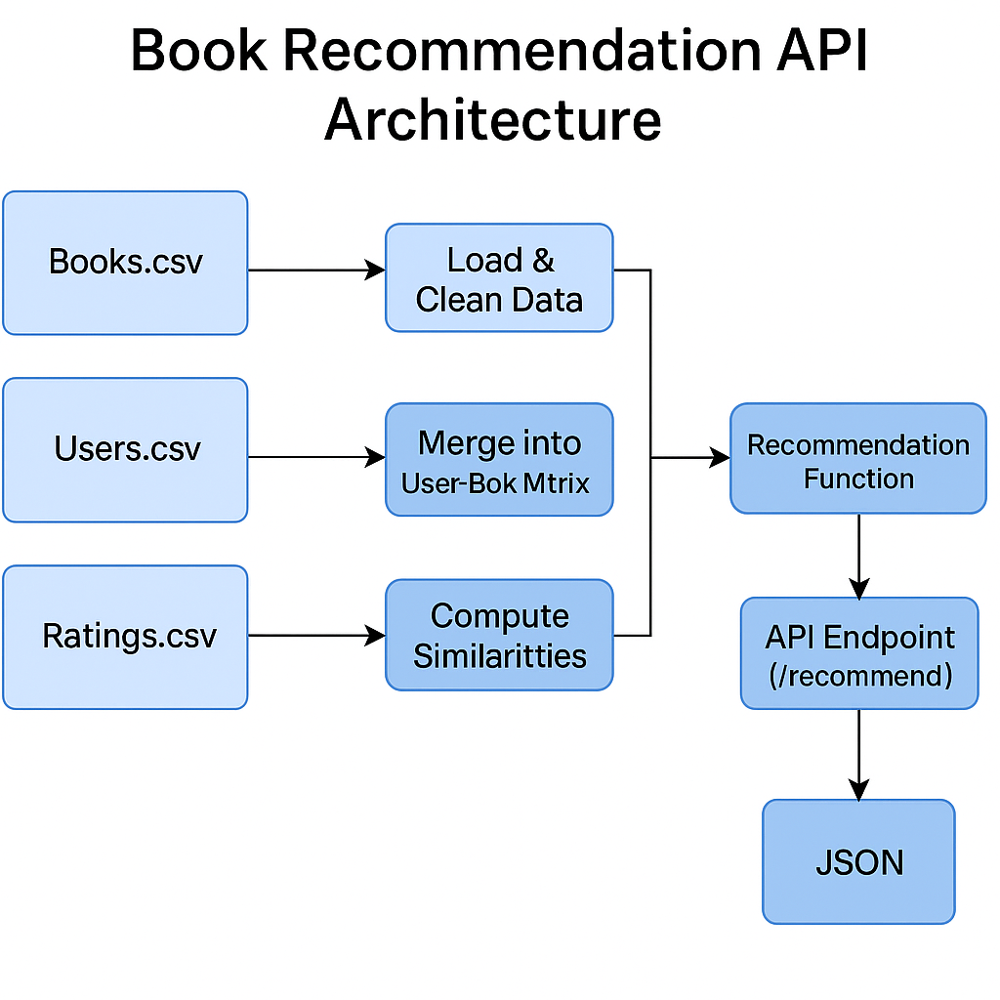

# 📚 Datasentics ML Engineer Assignment — Book Recommendation API

This project is a lightweight recommendation engine built on the Kaggle Book Recommendation dataset.  
It allows users to query similar books using a simple API.

---

## 🚀 Features

- Cleaned + merged `Books`, `Ratings`, and `Users` datasets using `pandas`
- Logic to recommend books based on shared user interests
- Exposed core logic as a **FastAPI** microservice
- Interactive Swagger UI at `/docs` to test the API
- Returns top recommended books for any input title

---

## 📦 Usage

### ▶️ Run the API

```bash
uvicorn app:app --reload
```

### 🔗 API Endpoint

- `GET /recommend?title=lord of the rings`

Response:
```json
[
  {"Book-Title": "Harry Potter and the Chamber of Secrets", "score": 55},
  {"Book-Title": "Harry Potter and the Prisoner of Azkaban", "score": 49}
]
```

---

## 📁 Folder Structure

```
📦 datasentics-book-recommender
├── app.py
├── Books.csv
├── Ratings.csv
├── Users.csv
├── requirements.txt
├── README.md
└── architecture.png
```

---

## ✅ Tech Stack

- Python 3.10
- Pandas
- FastAPI
- Uvicorn

---

## 🔮 Future Improvements

- Add fuzzy title search (partial match / typo handling)
- Add filter by genre or year
- Deploy to cloud or containerize with Docker

  ## 🧱 Architecture Diagram


